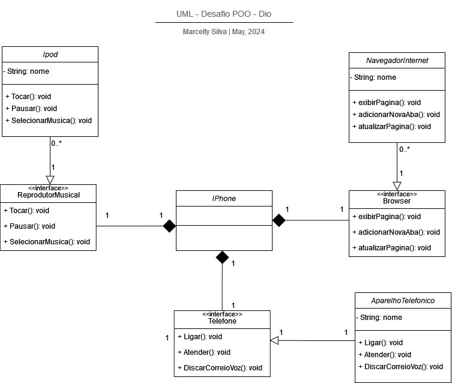

# Iphone POO Desafio DIO 🌟❤️📱
Este repositório foi criado para o estudo de Programação Orientada a Objetos, onde desenvolvi a implementação de um sistema bancário simples, utilizando conceitos como classes, classes abstratas, interfaces e listas.

## 📍Stack utilizada

<div>
  
</div>

## 📦 Estrutura do projeto
````
poo-iphone/
├── .settings/
├── bin/                              
├── src/                               
|   ├── celular/
|   |  ├── Iphone.java
|   └── menu/
|   |  |  ├── browser/
|   |  |  |  ├── Browser.java
|   |  |  |  └── NavegadorInternet.java
|   |  |  ├── home/
|   |  |  |  └── Home.java
|   |  |  ├── reprodutormusica/
|   |  |  |  ├── Ipod.java
|   |  |  |  └── ReprodutorMusica.java
|   |  |  └── telefone/
|   |  |  |  ├── AparelhoTelefonico.java
|   |  |  |  └── Telefone.java
└── ... (demais diretórios e arquivos)
````
## 📱Diagrama de Classe
<div>
  
</div>
